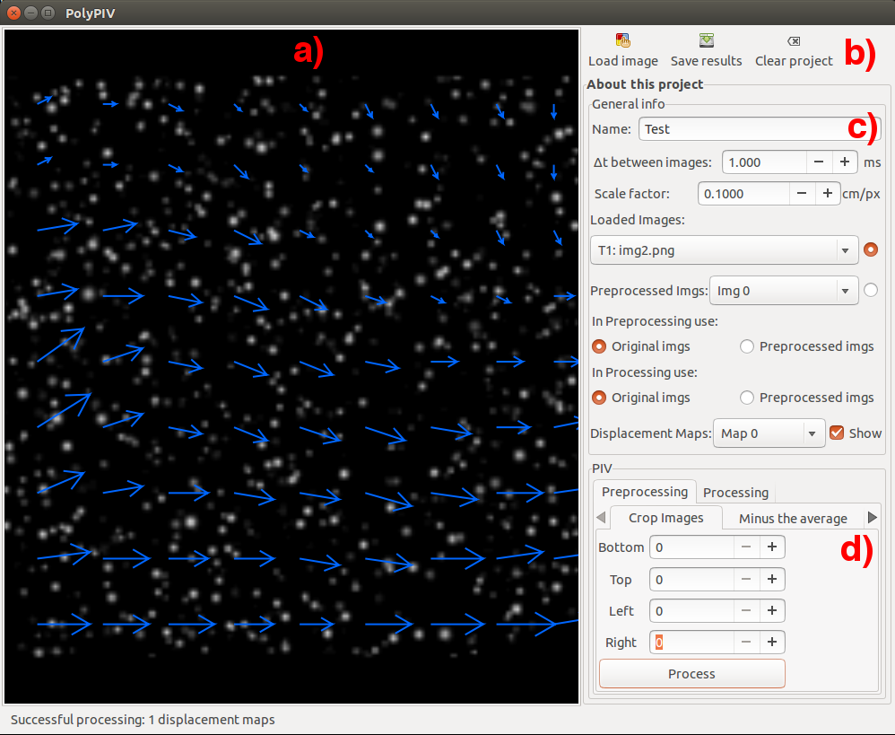

# PolyPIV
Particle Image Velocimetry software developed for my undergraduate thesis.

This award-winning software requires the following external libraries:
-FFTW for computing the discrete Fourier transform.
-FreeImage for saving images in several formats.
-GTK+ for managing the Graphic User Interface.

The GUI description was made on the GLADE software.

The development and testing environment included:
- Debian linux 7
- gcc version 5

#### Software Overview

a) Display Area
b) Load/Save/Reset buttons
c) General paramenters and settings.
d) Algorithms selection and execution.

###### License

The PolyPIV software is licensed under the terms of the GPL version 3 (or later) license.

    Copyright (C) 2019 Didier Muñoz Díaz

    This program is free software: you can redistribute it and/or modify
    it under the terms of the GNU General Public License as published by
    the Free Software Foundation, either version 3 of the License, or
    (at your option) any later version.

    This program is distributed in the hope that it will be useful,
    but WITHOUT ANY WARRANTY; without even the implied warranty of
    MERCHANTABILITY or FITNESS FOR A PARTICULAR PURPOSE.  See the
    GNU General Public License for more details.

See <http://www.gnu.org/licenses/> for license details.
